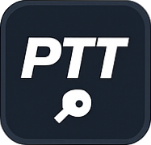

# Pro Table Tennis (PTT) - Web & Mobile App

## 📌 Descripción General

**Pro Table Tennis (PTT)** es una aplicación web y móvil para la gestión integral de clases, alumnos, materiales y torneos de tenis de mesa, orientada a profesores y centros de entrenamiento. Su diseño estará basado en principios de neumorfismo para ofrecer una experiencia de usuario elegante y moderna.

---

## 🧩 Tecnologías y Lenguajes

### Frontend
- **Lenguaje**: TypeScript
- **Framework**: React (recomendado por su rapidez y flexibilidad en móviles)
- **Estilo**: CSS Modules / Tailwind (con neumorfismo)
- **Compatibilidad**: Responsive (móvil y escritorio)
- **Testing**: Jest + React Testing Library
- **Internacionalización (i18n)**: Soporte opcional multilenguaje

### Backend
- **Lenguaje**: Node.js con Express _(alternativamente Python con Flask si se prefiere)_
- **Base de Datos**: MongoDB o PostgreSQL
- **Autenticación**: JWT + bcrypt
- **Testing**: Mocha + Chai (o PyTest si es Python)
- **Documentación API**: Swagger / Postman
- **Arquitectura**: REST API modular

---

## 🏗️ Arquitectura General

📦 PTT
├── backend
│ ├── controllers
│ ├── models
│ ├── routes
│ ├── middleware
│ ├── utils
│ ├── config
│ └── app.js / main.py
├── frontend
│ ├── public
│ ├── src
│ │ ├── assets
│ │ ├── components
│ │ ├── pages
│ │ ├── hooks
│ │ ├── services
│ │ ├── styles
│ │ └── App.tsx
│ └── index.tsx
└── README.md

---

## 🧠 Funcionalidades Principales

### 👥 Gestión de Alumnos
- Añadir, editar, eliminar, buscar alumnos
- Registrar asistencia y progreso
- Exportar informes en CSV
- Ver historial y rendimiento visualizado

### 📚 Gestión de Clases
- Crear y editar clases
- Asignar alumnos a clases
- Registrar asistencia en formato interactivo (mesa de ping pong)

### 📈 Progreso y Estadísticas
- Gráficas de rendimiento por alumno
- Registro visual de evolución por clases

### 📦 Gestión de Materiales
- Asignar y controlar equipamiento
- Seguimiento de estado y reemplazo

### 📅 Gestión de Eventos y Horarios
- Crear torneos, partidos y entrenamientos
- Calendario de sesiones y eventos

### 💳 Gestión de Pagos
- Registro de cuotas por alumno
- Control de pagos realizados y pendientes

### 🔒 Seguridad y Usuarios
- Sistema de autenticación (login/register)
- Gestión de roles (profesor, admin)
- Logging de eventos importantes

### 📬 Notificaciones y Feedback
- Alertas automáticas de eventos o vencimientos
- Sistema de sugerencias de los usuarios

### ⚙️ Extras y Escalabilidad
- Sistema de backup y recuperación
- Soporte técnico e internacionalización opcional
- Soporte accesibilidad (WCAG 2.1)

---

## 🗓️ Plan de Desarrollo (1 Mes)

| Semana | Tareas                                                                 |
|--------|------------------------------------------------------------------------|
| 1      | Setup proyecto, componentes básicos (Botón, Input, Tabla, Modal)       |
| 2      | Vistas principales: Dashboard, Alumnos, Detalles de alumno, Clases     |
| 3      | Lógica: Asistencia, Progreso, Materiales, Autenticación                |
| 4      | Reportes, Pagos, Eventos, Notificaciones, testing, documentación       |

---

## 🎨 Diseño Neumórfico

La interfaz utilizará un enfoque **neumórfico** con:
- Bordes suaves y sombras sutiles
- Colores claros y coherentes
- Efectos de profundidad para interacción
- Mesa de ping pong interactiva (para seleccionar alumno visualmente)

---

## 🧪 Calidad y Mantenimiento

- ✔️ Pruebas unitarias y de integración
- ✔️ Control de versiones con Git
- ✔️ Documentación automática de código (TypeDoc / Swagger)
- ✔️ Manejador de errores global
- ✔️ Linter + Prettier
- ✔️ Sistema de gestión de dependencias (npm o pip)
- ✔️ Deploy en Vercel (frontend) y Railway / Render (backend)

---

## 💼 Roles de Desarrollo

- **Frontend (Senior)**: Arquitectura, diseño, componentes, vistas
- **Backend (Junior)**: API RESTful, base de datos, autenticación, lógica

---

## 🧩 Potenciales Monetizaciones Futuras

- Planes premium para academias
- Sistema de reservas o agenda online
- Publicidad no invasiva
- Integración con sistemas de pago externo (Stripe)

---

## 📦 Archivos Incluidos

- Logo PTT: `logo_ptt.svg`
- Favicon: `favicon.ico`
- Diagrama estructura del proyecto: incluido arriba

---

## 🧠 Consideraciones Finales

> Este documento está preparado para la **versión MVP** de la aplicación y se puede extender con nuevas funcionalidades de manera modular. Es crucial mantener un código limpio, bien documentado y probado para garantizar escalabilidad y mantenibilidad.

## Preview
