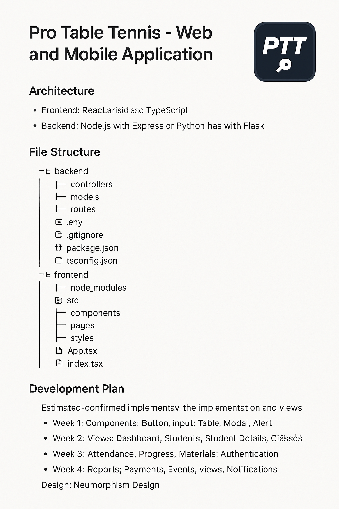

# Pro Table Tennis (PTT): Documentación Genérica

## Sistema de Gestión para Profesores y Torneos de Tenis de Mesa (Ping Pong)

## Tabla de Contenidos

1. [Introducción](#introducción)

2. [Arquitectura del Sistema](#arquitectura-del-sistema)

3. [Tech Stack](#tech-stack)

4. [Estructura del Proyecto](#estructura-del-proyecto)

5. [Diseño UI/UX](#diseño-uiux)

6. [Plan de Implementación](#plan-de-implementación)

7. [Pruebas y Calidad](#pruebas-y-calidad)

8. [Despliegue y Mantenimiento](#despliegue-y-mantenimiento)

9. [Roadmap Futuro](#roadmap-futuro)

10. [Monetización](#monetización)

11. [Recursos Adicionales](#recursos-adicionales)

12. [Equipo](#equipo)

---

## Introducción

**Pro Table Tennis (PTT)** es una aplicación web y móvil para gestión integral de alumnos, clases, materiales y pagos en escuelas de tenis de mesa. Orientada a profesores con enfoque en usabilidad y experiencia visual, como primer objetivo prioritario. En segundo lugar pero no menos importante, también se hace cargo de la gestión integral de creación de torneos.

**Objetivos Clave:**

- Gestión centralizada de alumnos y clases (Requerido)

- Seguimiento de progreso y asistencia (Requerido)

- Sistema de pagos integrado (Requerido)

- Visualización intuitiva con mesa interactiva (Requerido)

- Diseño elegante con neumorfismo (Opcional)

- Monetización (Requerido)

- [Creación de torneos (Requerido)](./PPT-torneos.md)

---

## Arquitectura del Sistema

### Diagrama de Arquitectura

````bash

[Frontend] → [Backend API] ← [Base de Datos]

↑               ↑               ↑

(Web)         (Microservicios)  (Redis)

(Móvil)        (Auth)          (Backups)

(Notificaciones)

```bash

### Componentes Principales

1. **Frontend**:

- Web: React.js + TypeScript

- Móvil: React Native + TypeScript

- State Management: Redux Toolkit

2. **Backend**

- Node.js + Express + TypeScript

- Base de Datos: PostgreSQL

- Autenticación: JWT

3. **Servicios Adicionales**

- Redis: Caché y sesiones

- AWS S3: Almacenamiento de archivos

- SendGrid: Notificaciones por email
````

---

## Tech Stack

| Área             | Tecnologías                                                            |
| ---------------- | ---------------------------------------------------------------------- |
| **Frontend**     | React 18, React Native, TypeScript, Redux Toolkit, Axios, Tailwind CSS |
| **Backend**      | Node.js 18, Express, TypeScript, TypeORM, PostgreSQL, JWT              |
| **Testing**      | Jest, React Testing Library, Cypress, Supertest                        |
| **DevOps**       | Docker, GitHub Actions, AWS EC2, Winston (logging)                     |
| **Herramientas** | ESLint, Prettier, Swagger, Storybook                                   |

**Justificación:**

- TypeScript para tipado estático

- React/React Native para reutilización de código

- PostgreSQL para relaciones complejas

- Tailwind CSS para neumorfismo eficiente

---

## Estructura del Proyecto

### Tree del Proyecto

```bash
ptt-manager/

├── apps/

│   ├── web/                   # Aplicación web

│   │   ├── public/

│   │   │   └── favicon.ico    # Favicon PTT

│   │   ├── src/

│   │   │   ├── assets/        # Imágenes, fuentes

│   │   │   ├── components/    # Componentes reutilizables

│   │   │   │   ├── ui/        # Componentes UI neumórficos

│   │   │   │   ├── table/     # Componentes de mesa ping pong

│   │   │   │   └── ...

│   │   │   ├── features/      # Lógica por funcionalidad

│   │   │   │   ├── students/  # Gestión alumnos

│   │   │   │   ├── attendance/# Asistencia

│   │   │   │   └── ...

│   │   │   ├── layouts/       # Layouts principales

│   │   │   ├── pages/         # Vistas/páginas

│   │   │   ├── services/      # Conexión API

│   │   │   ├── store/         # Redux store

│   │   │   ├── styles/        # Estilos globales

│   │   │   ├── utils/         # Utilidades

│   │   │   └── App.tsx        # Punto de entrada

│   │   └── ...

│   │

│   └── mobile/                # Aplicación móvil (estructura similar)

│

├── backend/                   # Servidor API

│   ├── src/

│   │   ├── config/            # Configuraciones

│   │   ├── controllers/       # Controladores

│   │   ├── entities/          # Entidades DB

│   │   ├── middlewares/       # Middlewares

│   │   ├── migrations/        # Migraciones DB

│   │   ├── routes/            # Rutas API

│   │   ├── services/          # Lógica de negocio

│   │   ├── utils/             # Utilidades

│   │   └── server.ts          # Punto de entrada

│   └── ...

│

├── shared/                    # Código compartido

│   ├── interfaces/            # Interfaces TS

│   └── ...

│

├── docs/                      # Documentación

├── .env.example               # Variables de entorno

└── ...
```

### Componentes Clave Frontend

- `PingPongTable`: Vista interactiva de mesa

- `StudentCard`: Tarjeta de alumno

- `AttendanceTracker`: Registro de asistencia

- `PaymentForm`: Gestión de pagos

- `ProgressChart`: Gráfico de progreso

---

## Diseño UI/UX

### Neumorfismo Implementado

```css
/* styles/neumorphic.css */

.neumorphic-card {
  border-radius: 20px;

  background: #e0e5ec;

  box-shadow: 8px 8px 16px #b8bec7, -8px -8px 16px #ffffff;

  transition: all 0.3s ease;
}

.neumorphic-button {
  border-radius: 15px;

  background: #e0e5ec;

  box-shadow: 5px 5px 10px #b8bec7, -5px -5px 10px #ffffff;

  border: none;

  padding: 12px 24px;
}

.neumorphic-button:active {
  box-shadow: inset 5px 5px 10px #b8bec7, inset -5px -5px 10px #ffffff;
}
```

### Vista de Mesa Ping Pong

```jsx
// components/table/PingPongTable.jsx

const PingPongTable = ({ students, onSelectStudent }) => (
  <div className="neumorphic-card p-6">
    <div className="table-design bg-green-600 rounded-xl relative h-64 w-full">
      {students.map((student, position) => (
        <div
          key={student.id}
          className={`player-position position-${position}`}
          onClick={() => onSelectStudent(student)}
        >
          <Avatar name={student.name} />
        </div>
      ))}
    </div>
  </div>
);
```

### Paleta de Colores

| Uso        | Color          | Hexadecimal |
| ---------- | -------------- | ----------- |
| Fondo      | Light Gray     | `#e0e5ec`   |
| Primario   | Deep Blue      | `#4e54c8`   |
| Secundario | Vibrant Orange | `#f9a826`   |
| Texto      | Dark Gray      | `#2d3748`   |

### Accesibilidad

- Contraste mínimo 4.5:1

- Soporte para navegación por teclado

- Etiquetas ARIA en componentes interactivos

- Modo alto contraste opcional

---

## Plan de Implementación

### Cronograma (4 semanas)

#### Semana 1: Core y Autenticación

| Tarea                 | Responsable | Estimación   |
| --------------------- | ----------- | ------------ |
| Configuración inicial | Full Team   | 1 día        |
| Autenticación (JWT)   | Backend     | 1.5 días     |
| CRUD Alumnos          | Full Team   | 2 días       |
| Vista lista alumnos   | Frontend    | 1 día        |
| **Total**             |             | **5.5 días** |

#### Semana 2: Funcionalidades Clave

| Tarea                  | Responsable | Estimación   |
| ---------------------- | ----------- | ------------ |
| Vista Ping Pong Table  | Frontend    | 2 días       |
| Gestión de Clases      | Backend     | 1 día        |
| Registro Asistencia    | Full Team   | 1.5 días     |
| Sistema Pagos (Stripe) | Backend     | 2 días       |
| **Total**              |             | **6.5 días** |

#### Semana 3: Funcionalidades Avanzadas

| Tarea                  | Responsable | Estimación |
| ---------------------- | ----------- | ---------- |
| Seguimiento Progreso   | Full Team   | 2 días     |
| Generación de Informes | Frontend    | 1.5 días   |
| Notificaciones         | Backend     | 1 día      |
| Exportación CSV        | Full Team   | 0.5 días   |

#### Semana 4: Testing y Despliegue

| Tarea               | Responsable | Estimación   |
| ------------------- | ----------- | ------------ |
| Pruebas unitarias   | Full Team   | 2 días       |
| Pruebas integración | Full Team   | 1.5 días     |
| Ajustes UI/UX       | Frontend    | 1 día        |
| Despliegue inicial  | Full Team   | 1 día        |
| **Total**           |             | **5.5 días** |

**Total Estimado:** 22.5 días (con margen para imprevistos)

## Pruebas y Calidad

### Estrategia de Testing

1. **Unit Testing (Jest)**

   - Cobertura > 80% en lógica crítica.
   - Mocking de API calls.

2. **Integration Testing (Cypress)**

   ```javascript
   // Ejemplo: Flujo de registro de alumno
   describe("Student Registration", () => {
     it("Adds new student successfully", () => {
       cy.visit("/students");
       cy.get('[data-testid="add-student-btn"]').click();
       cy.get("#student-name").type("Juan Pérez");
       cy.get("#student-email").type("juan@example.com");
       cy.get('[data-testid="submit-btn"]').click();
       cy.contains("Estudiante añadido correctamente").should("be.visible");
     });
   });
   ```

3. **Pruebas de Usabilidad**

   - Test A/B para componentes clave.
   - Feedback temprano con profesores reales.
   - Cobertura > 80% en lógica crítica
   - Mocking de API calls

4. **Integration Testing (Cypress)**

   ```javascript
   // Ejemplo: Flujo de registro de alumno

   describe("Student Registration", () => {
     it("Adds new student successfully", () => {
       cy.visit("/students");

       cy.get('[data-testid="add-student-btn"]').click();

       cy.get("#student-name").type("Juan Pérez");

       cy.get("#student-email").type("juan@example.com");

       cy.get('[data-testid="submit-btn"]').click();

       cy.contains("Estudiante añadido correctamente").should("be.visible");
     });
   });
   ```

5. **Pruebas de Usabilidad**

   - Test A/B para componentes clave
   - Feedback temprano con profesores reales

### Calidad de Código

    - ESLint con config estándar TypeScript
    - Pre-commit hooks con Husky
    - Revisión de código diaria
    - Documentación JSDoc obligatoria

## Despliegue y Mantenimiento

### Infraestructura

- **Frontend:** Vercel (web) / Expo (mobile)

- **Backend:** AWS EC2 (t2.micro)

- **Base de Datos:** AWS RDS (PostgreSQL)

- **Almacenamiento:** AWS S3

### CI/CD Pipeline

| Paso                 | Descripción                         |
| -------------------- | ----------------------------------- |
| Git Push             | Se realiza un push al repositorio   |
| GitHub Actions       | Se dispara el workflow de CI/CD     |
| Run Tests            | Ejecución de pruebas automáticas    |
| Build Artifacts      | Construcción de artefactos          |
| Deploy to Staging    | Despliegue en entorno de staging    |
| Manual Approval      | Aprobación manual para producción   |
| Deploy to Production | Despliegue en entorno de producción |

### Backup y Recuperación

- Backups diarios automáticos (AWS RDS Snapshots)

- Replicación en múltiples AZs

- Scripts de recuperación documentados

---

## Roadmap Futuro

### Fase 2 (2 meses)

1. App móvil nativa (iOS/Android)

2. Panel de alumno con progreso personal

3. Integración con wearables (tracking físico)

4. Sistema de torneos y rankings

## Monetización

1. Suscripciones premium para academias

2. Comisión en pagos de clases

3. Publicidad contextual (equipamiento)

4. Marketplace de materiales

[Extensión del apartado](./PPT-monetización.md)

---

## Recursos Adicionales

### Alternativa para Logo y Favicon


### Prototipo de documentación oficial



## Equipo

- **Frontend Senior:** Alexander Hernández Martín

- **Backend Senior:** Alexander Hernández Martín

- **Diseño UI/UX:** Ana Morales Lorente
